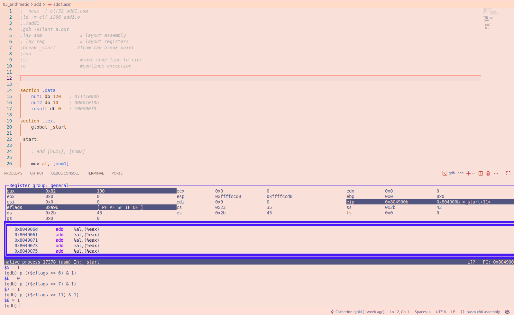
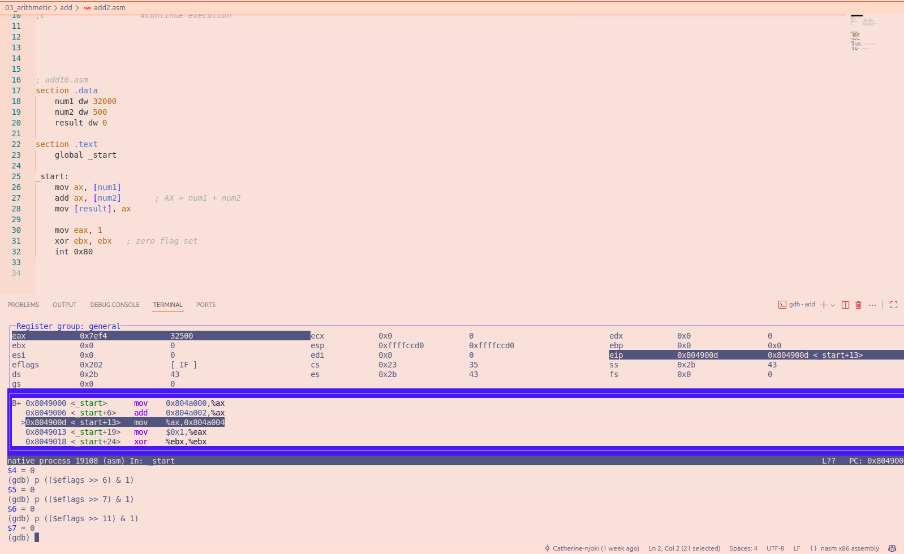
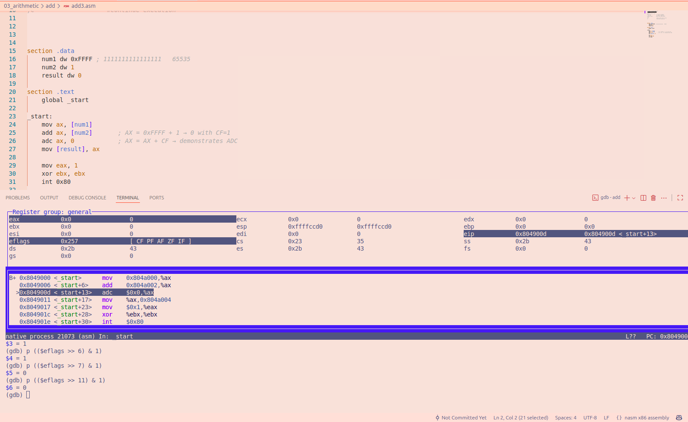

# File add1.asm

This program adds two 8-bit numbers: 120 and 10.

**Result:** 130 (unsigned), stored as `0x82` in hexadecimal.

### FLAGS Results

CF =   0 : No carry out of the most significant bit.       
PF =   1 :The result has even parity.                     
AF =   1 : A carry occurs from bit 3 to bit 4.             
ZF =   0 :The result is not zero.                         
SF =   1 :The most significant bit is 1.                  
OF =   1 :Signed overflow occurs because 130 exceeds 127. 

### GDB Screenshot

# File add2.asm
This program adds two 16-bit numbers, 32000 and 500 using AX register

**Result:** 
First number = 32000
Second number = 500
Result :32500
hex: `0x7ef4`

### Flags Result:

CF =  0 ;No carry out of the most significant bit.      
PF =  0 ;The lowest byte has odd parity.                   
AF =  0 ;No carry from bit 3 to bit 4.           
ZF =  0 ;The result is not zero.                        
SF =  0 ;The most significant bit is 0.                 
OF =  0 ;No signed overflow occurred.

### GDB image

# File add3.asm

This program adds `0xFFFF` and `1` using 16-bit arithmetic, then demonstrates the ADC (Add with Carry) instruction.

**Results:**
The instruction `add ax, [num2]` adds 1 to 65535. 
Since AX is a 16-bit register, the result wraps around to zero, setting the Carry Flag.

### FLAGS Results After ADD

CF = 1 ;Carry out of the 16-bit result.  
PF = 1 ; The lowest byte has even parity. 
AF = 1 ; Carry from bit 3 to bit 4.       
ZF = 1 ; The result is zero.              
SF = 0 ; The sign bit is zero.            
OF = 0 ; No signed overflow occurred.     

### ADC Instruction

The instruction `adc ax, 0` adds the source operand and the current Carry Flag to AX. 
Since AX is zero and CF is one, AX becomes 1.

### Conclusion

This program shows that when adding 1 to 65535, the result is too large to fit in a 16-bit register. 
AX therefore stores 0, and the Carry Flag is set to 1. 
The ADC instruction then uses that carry to add 1 to AX, making the result 1.
This shows how ADC can use a carry from a previous addition.

### GDB image
 