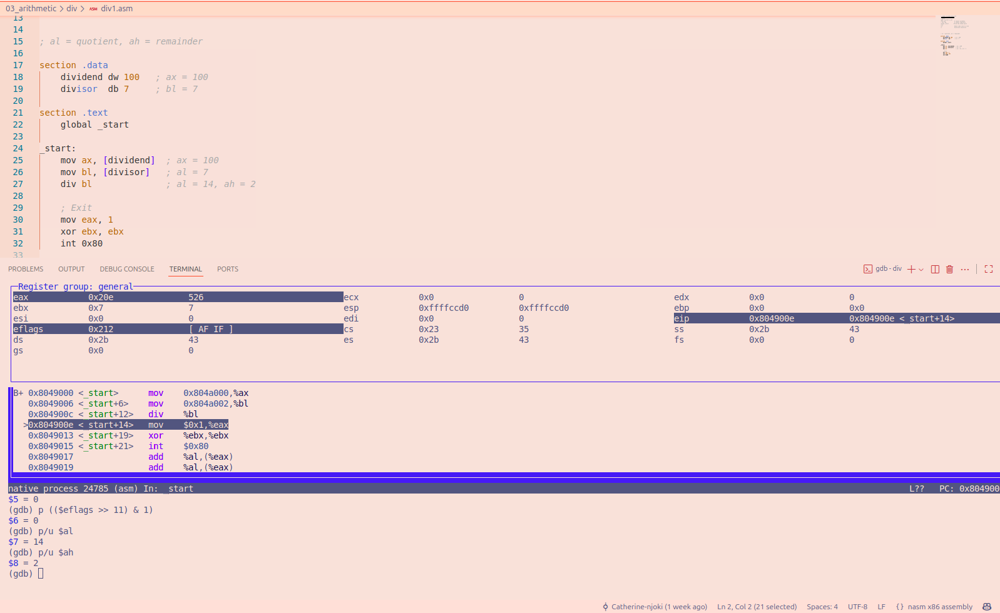
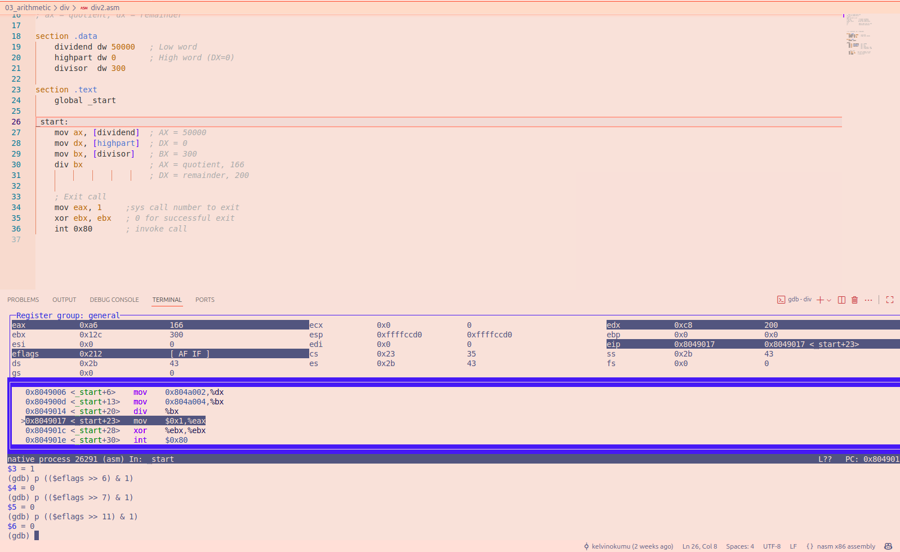
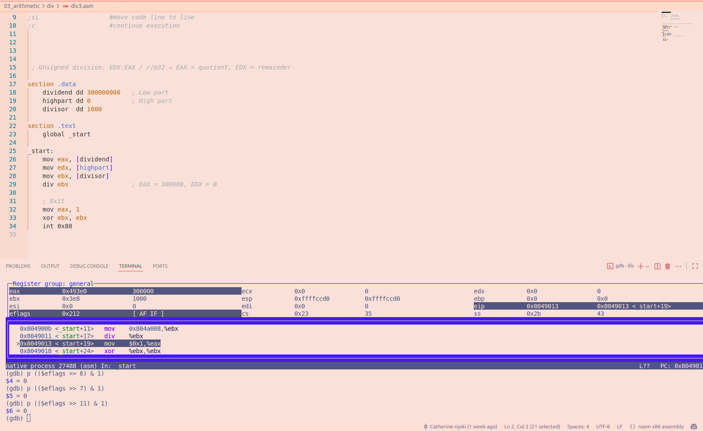

# FILE div1.asm

This program divides 100 by 7

**Result:**
Divisor =7 in bl
Dividend =100 in ax
Qoutient =14 stored in AL
Remainder =2 stored in AH

### Flags Result

CF =0     
PF =0                   
AF =1           
ZF =0                     
SF =0                  
OF =0

For the flags, they are undefined because the processor does not guarantee the flag's result.

### GDB image

# FILE div2.asm

This program divides 50000 by 300

**Result:**
Dividend: 50000 in DX
Divisor: 300 in BX  , the DIV BX instruction performs unsigned division using the combined DX register pair as the dividend.
Quotient: 166 stored in AX
Remainder: 200 stored in DX

### Flags result

CF =0     
PF =0                   
AF =1           
ZF =0                     
SF =0                  
OF =0

For the flags, they are undefined because the processor does not guarantee the flag's result.

### GDB image

# FILE div3.asm

The program divides 300000000 by 1000

**Result:**
Dividend: 300000000
Divisor: 1000
Quotient: 300000 stored in EAX
Remainder: 0 which is stored in EDX

### Flags Results
CF =0     
PF =0                   
AF =1           
ZF =0                     
SF =0                  
OF =0

For the flags, they are undefined.

### GDB image
