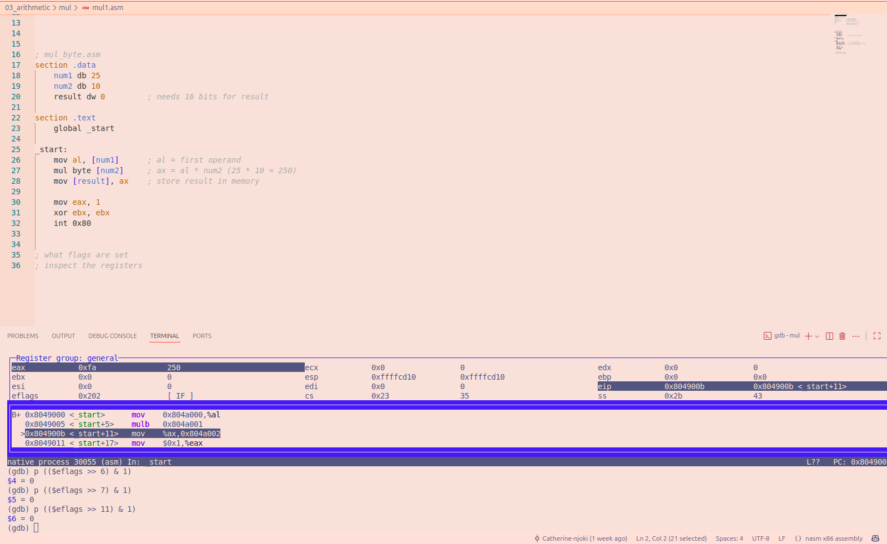
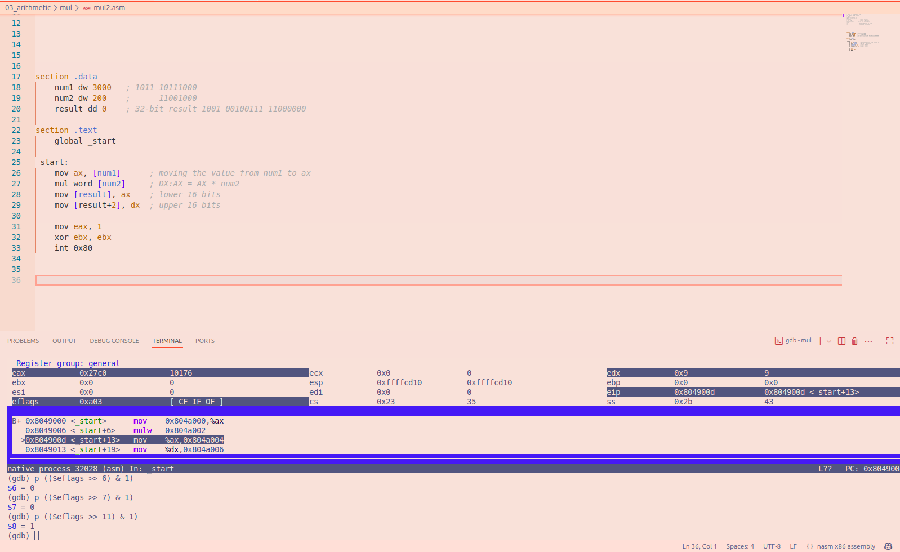
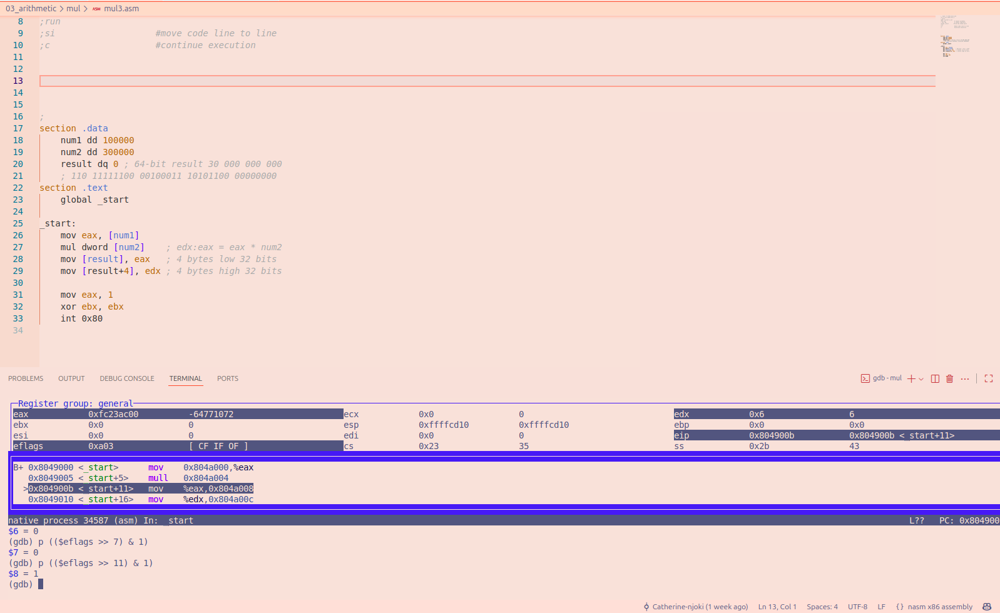

# File mul1.asm

This program multiplies two 8-bit unsigned numbers, 25 and 10 using the MUL instruction.

**Results:**

First operand = 25
Second operand = 10
Product = 250
Result is stored in AX = 250 (`0x00FA`)
AL = 250
AH = 0

### FLAGS Results

The values after MUL:

CF =  0                     
PF =  0                    
AF =  0            
ZF =  0                        
SF =  0                 
OF =  0 

### My Why
For unsigned MUL, CF and OF are cleared because the upper half of the product is zero. PF, AF, ZF, and SF are undefined, so their observed values are not guaranteed.
The result fits in the lower 8 bits, so the upper half of AX is zero and both CF and OF are cleared.

### GDB image

# File mul2.asm

This program multiplies two 16-bit unsigned numbers, 3000 and 200 using the MUL.

**Results:**

First operand: 3000
Second operand: 200
Product: 600000
Lower half (AX): 10176 (`0x27C0`)
Upper half (DX): 9 (`0x0009`)

### FLAGS Results

The values after MUL:

CF =  1 ;the upperhalf of the product ain't a zero                    
PF =  0                    
AF =  0            
ZF =  0                        
SF =  0                 
OF =  1 ;the upperhalf of the product ain't a zero

### My Why
For unsigned MUL, CF and OF are guaranteed because the upper half of the product is a non-zero. PF, AF, ZF, and SF are undefined, so their observed values are not guaranteed.

### GDB image

# File mul3.asm

This program multiplies two 8-bit unsigned numbers, 25 and 10 using the MUL instruction.

**Results:**

First operand = 25
Second operand = 10
Product = 250
Result is stored in AX = 250 (`0x00FA`)
AL = 250
AH = 0

### FLAGS Results

The values after MUL:

CF =  1 :upperhalf is non zero                     
PF =  0                    
AF =  0            
ZF =  0                        
SF =  0                 
OF =  1 :upperhalf is non-zero 

### My Why
For unsigned MUL, CF and OF have values because the upper half of the product is non-zero. PF, AF, ZF, and SF are undefined, so their observed values are not guaranteed.

100000 is multiplied by 300000 to produce a large number which cannot fit because it's more than 32 bits, so it is stored across EDX.

### GDB image
