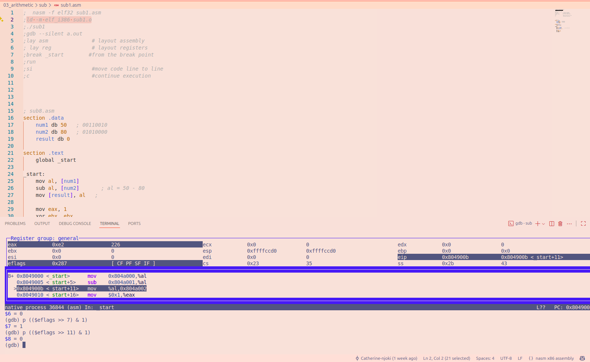
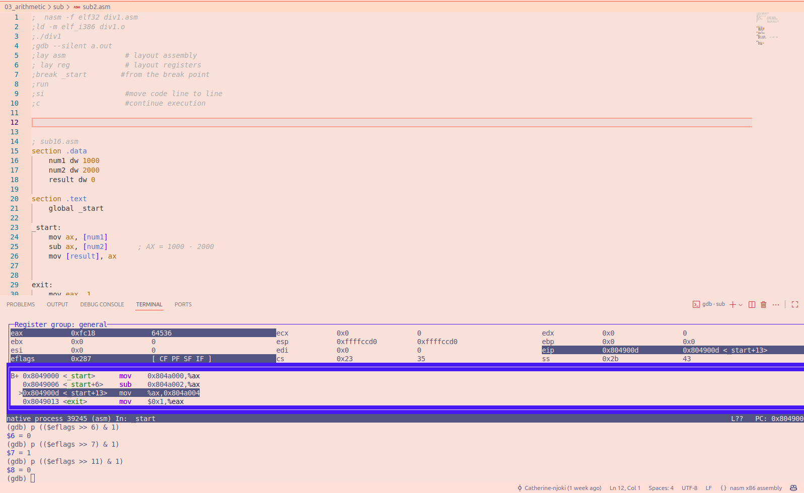
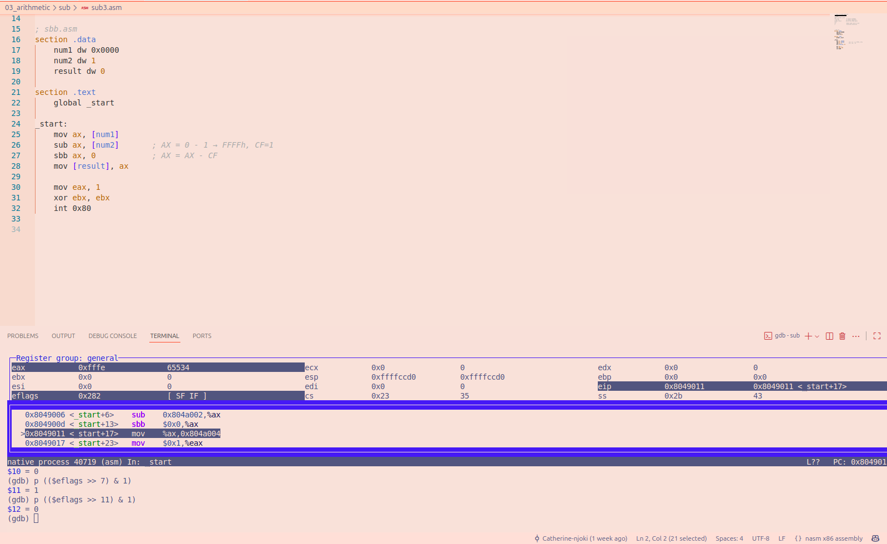

# File sub1.asm

The program subtracts `num2` (80) from `num1` (50) using the 8-bit `AL` register.

**Result:**
50 − 80 = −30

`AL` is an 8-bit register, the result is stored as `11100010` in binary (`0xE2` in hexadecimal). 

This represents 226 as an unsigned value or −30 as a signed value.

## Flag Results after SUB

CF = 1 ; A borrow is done because 50 is less than 80 as unsigned numbers. 
PF = 1 ;The result has four 1 bits, giving even parity.                            
AF = 0 ;No borrow occurs between the lower and upper nibbles.                        
ZF = 0 ;The result is not zero.                                                      
SF = 1 ;The most significant bit of the result is 1.                                 
OF = 0 ;The signed result, −30, fits in the 8-bit signed range of −128 to 127.     

## Conclusion

The `SUB` instruction subtracts the second operand from the first and updates the CPU status flags. 
The Carry Flag can be set because of an unsigned borrow even when the Overflow Flag is clear because the signed result is within range.

## GDB Screenshot

# File sub2.asm

The program loads 1000 into the AX register and subtracts 2000 from it. The result is stored in the 16-bit variable result.

**Result:**
1000 − 2000 = −1000

## Flag Results after SUB

CF = 1 ; An unsigned borrow occurs because 1000 is less than 2000.
PF = 1 ; The lowest byte has an even number of set bits.                          
AF = 0 ;The lowest byte has an even number of set bits.                        
ZF = 0 ;The result is not zero.                                                      
SF = 1 ;The most significant bit of the result is 1.                                 
OF = 0 ;The signed result fits in the 16-bit signed range of −32768 to 32767.

    

## Conclusion
The SUB instruction subtracts the source from the destination operand and updates the CPU status flags. 

This sets the Carry Flag because an unsigned borrow occurs, while the Overflow Flag remains clear because the signed result is within range.

## GDB Screenshot

# File sub3.asm

The program initializes AX to zero, subtracts 1 using SUB, and then uses SBB to subtract another value while accounting for the Carry Flag.

**Result:**
0 − 1 = 0xFFFF  this is for SUB
0xFFFF − 0 − 1 = `0xFFFE` (65534 unsigned or −2 signed) this is for SBB

## Flag Results after SUB

 # This is after SUB
CF = 1 ; A borrow was needed, subtracting 1 from 0
PF = 1 ; The lowest byte is 11111111, even parity                          
AF = 1 ; A borrow occurs between the lower and upper four bits                       
ZF = 0 ; The result is 0FFFF ,a non zero                                                  
SF = 1 ;  The highest bit is 1, so the result is negative as a signed number                         
OF = 0 ; The signed result -1 fits within the 16-bit range 0f -32768 to 32767  

# This is after SBB
CF = 0 ;No borrow needed 
PF = 0 ; The lowest bit is 11111110 an odd parity                          
AF = 0 ; The lower nibble changes from F to E ,thus ,no borrow is needed between the nibbles                       
ZF = 0 ; The result `0xfffe` is not zero                                                  
SF = 1 ; The highest bit remains 1, a negative signed result                          
OF = 0 ;  The signed result, -2 is within the 16-bit signed range

## Conclusion
The SUB instruction performs ordinary subtraction, while SBB subtracts the source operand and the incoming Carry Flag.

This allows subtraction operations to account for a borrow when working with larger multiword values.

## GDB Screenshot

